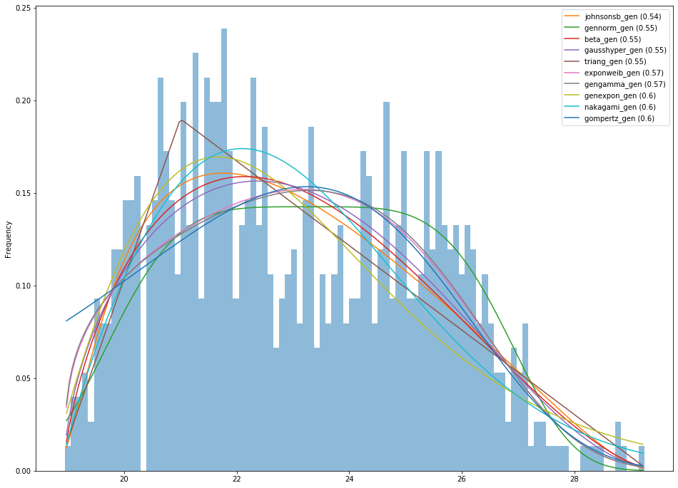

# PyIDD
Identify the Distribution of your Data <br />
This package helps you for identifing the distribution of your data. For example if you want to know whether your data follow Normal distribution, you can use this package!

## Installation

```
pip install pyidd
```

## Usage
```python
import pyidd
import statsmodels.api as sm

# Load sample dataset (data is an one dimensional array)
data = sm.datasets.elnino.load_pandas().data.set_index('YEAR').values.ravel()

# verbose=0 means silent while fitting and verbose=1 means say anything you do while fitting
p = pyidd.PyIDD(verbose=1)
p.fit(data)

# After fitting, you can get distribution sorted by Sum of Squered Error that fit your data, so the first distribution is the distribution that is closer to your data
p.get_distributions()

# You can also plot distributions and your data to see this visualy. top=10 means that you want to plot top 10 distributions that match your data
p.plot(top=10)

```


## Distributions
We use almost all scipy.stats continiuse distributions (Notics: The distributions that can not fit to your data get ignored). These distributions are listed below:
- alpha
- anglit
- arcsine
- argus
- beta
- betaprime
- bradford
- burr
- burr12
- cauchy
- chi
- chi2
- cosine
- crystalball
- dgamma
- dweibull
- erlang
- expon
- exponnorm
- exponweib
- exponpow
- f
- fatiguelife
- fisk
- foldcauchy
- foldnorm
- frechet_r
- frechet_l
- genlogistic
- gennorm
- genpareto
- genexpon
- genextreme
- gausshyper
- gamma
- gengamma
- genhalflogistic
- geninvgauss
- gilbrat
- gompertz
- gumbel_r
- gumbel_l
- halfcauchy
- halflogistic
- halfnorm
- halfgennorm
- hypsecant
- invgamma
- invgauss
- invweibull
- johnsonsb
- johnsonsu
- kappa4
- kappa3
- ksone
- kstwo
- kstwobign
- laplace
- levy
- levy_l
- logistic
- loggamma
- loglaplace
- lognorm
- loguniform
- lomax
- maxwell
- mielke
- moyal
- nakagami
- ncx2
- ncf
- nct
- norm
- norminvgauss
- pareto
- pearson3
- powerlaw
- powerlognorm
- powernorm
- rdist
- rayleigh
- rice
- recipinvgauss
- semicircular
- skewnorm
- t
- trapz
- triang
- truncexpon
- truncnorm
- tukeylambda
- uniform
- vonmises
- vonmises_line
- wald
- weibull_min
- weibull_max
- wrapcauchy
